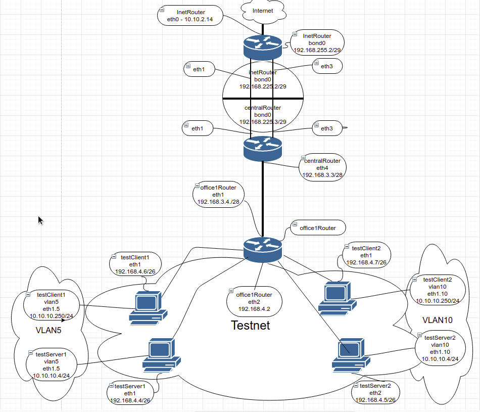

# Сетевые пакеты, VLAN, LACP
## Домашнее задание  по теме

Задание:

в Office1 в тестовой подсети появляется сервера с доп интерфесами и адресами в internal сети testLAN

testClient1 - 10.10.10.254
testClient2 - 10.10.10.254
testServer1- 10.10.10.1
testServer2- 10.10.10.1
равести вланами testClient1 <-> testServer1 testClient2 <-> testServer2

между centralRouter и inetRouter "пробросить" 2 линка (общая inernal сеть) и объединить их в бонд проверить работу c отключением интерфейсов

Решение:

На inetRouter и centralRouter добавим по дополнительному интерфейсу, и на основе существующго и дополнительного создадим на обеих машинах bond0 интерфейс, в который включим существующие физические интерфейсы на обеих машинах (eth1  и eth3 )

[Параметры bond0 машина inetRouter](ansible/roles/vlan/templates/centralRouterifcfg-bond0.j2) - ip задаём 192.168.255.3  на bond0 интерфейсе
[Параметры bond0 машина centralRouter](ansible/roles/vlan/templates/inetRouterifcfg-bond0.j2) - ip задаём 192.168.255.2  на bond0 интерфейсе

сетевые интерфейсы, участвующие в создании отказоустойчивого и агреггированого канала, на базе bond0 интерфейсов на каждой машине:

inetRouter:

[Параметры сетевой карты eth1](ansible/roles/vlan/templates/inetRoutereth1.j2)  
[Параметры сетевой карты eth3](ansible/roles/vlan/templates/inetRoutereth3.j2)  

centralRouter:

[Параметры сетевой карты eth1](ansible/roles/vlan/templates/centralRoutereth1.j2)  
[Параметры сетевой карты eth3](ansible/roles/vlan/templates/centralRoutereth3.j2)  

___

С помощью vlan сможем развести компьютеры с одинаковыми IP адресами, так, что они могут работать одновременно.  

2 компьютера находятся в велане 5:

      testClient1 - eth1.5 vlan5 10.10.10.250
      testServer1 - eth1.5 vlan5 10.10.10.4

2 компьютера находятся в велане 10:

      testClient2 - eth1.10 vlan5 10.10.10.250
      testServer2 - eth1.10 vlan5 10.10.10.4

Пинги между машинами в одном велане не пересекаются с пингами из второго велана. С помощью tcpdump-a в этом можно убедиться.

Общая схема подключения представленна на рисунке:

#   Общая теория, примеры, полезности.

Чтобы узнать через какой интерфейс (шлюз) должен маршрутизироваться трафик к определенному IP адресу используется команда:

ip route get 192.168.2.45
